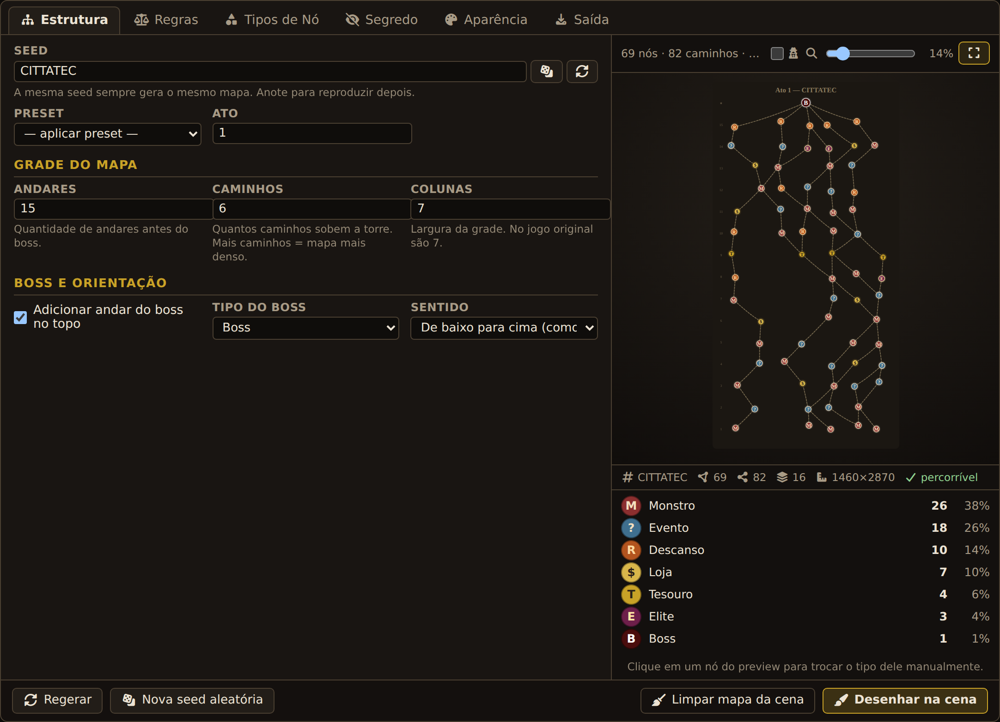
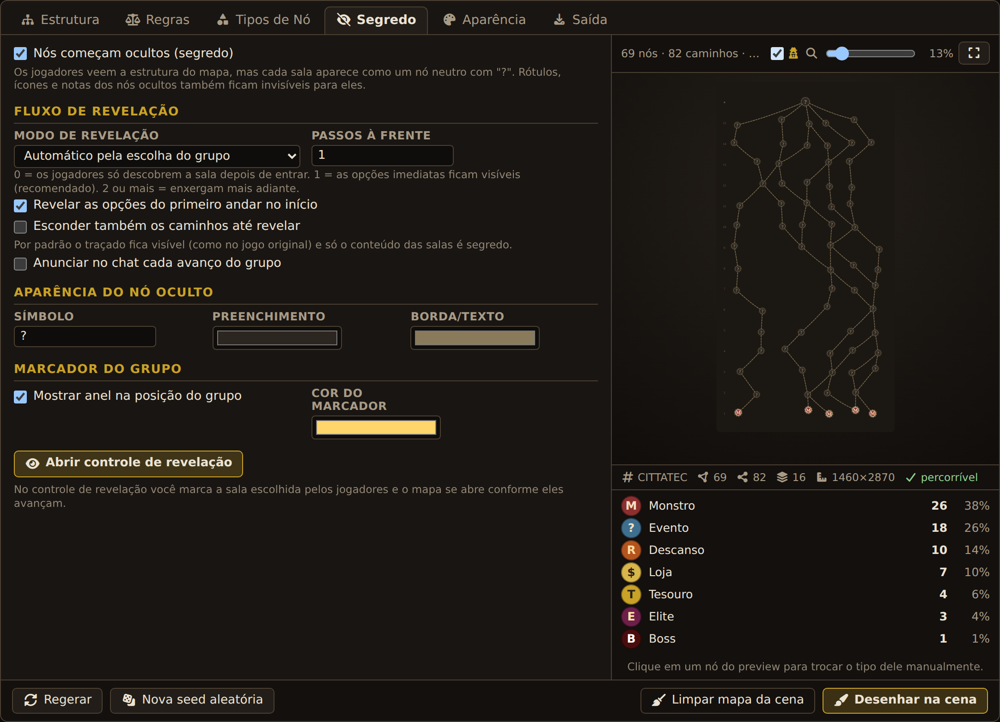
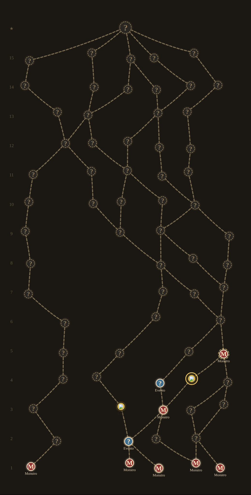
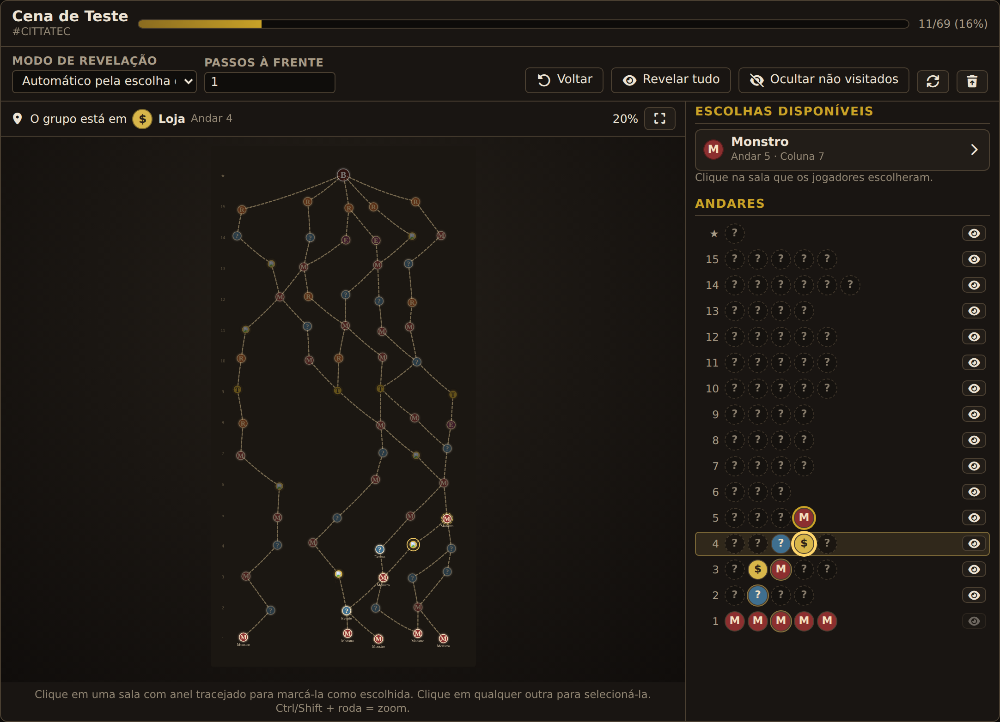

# Spire Map — Gerador de Mapas estilo Slay the Spire

Módulo para **Foundry VTT v13** que gera mapas ramificados no estilo *Slay the Spire* e os
desenha diretamente na cena, com um painel de configuração completo, preview ao vivo e
**revelação progressiva**: as salas nascem secretas e o Mestre as abre conforme os jogadores
escolhem o caminho.



---

## Instalação

### Opção A — arquivo .zip

1. Descompacte `spire-map.zip` dentro da pasta `Data/modules/` do seu Foundry.
   O resultado deve ser `Data/modules/spire-map/module.json`.
2. Reinicie o Foundry e ative **Spire Map** em *Configurações → Gerenciar Módulos*.

### Opção B — manifesto

Em *Add-on Modules → Install Module*, cole a URL do `module.json` do seu repositório.

> A pasta **precisa** se chamar `spire-map` — o Foundry usa o `id` do manifesto para
> resolver os caminhos dos templates e do CSS.

---

## Como usar

Três formas de abrir o painel (somente Mestre):

| Forma | Onde |
| --- | --- |
| Botão | Barra de ferramentas da cena, grupo **Desenhos** (ícone de diagrama) |
| Atalho | `Alt + M` (configurável em *Configurar Controles*) |
| Configurações | *Configurações do Módulo → Spire Map → Abrir painel* |

E o **controle de revelação** pelo botão do olho na mesma barra, ou `Alt + R`.

Fluxo normal: ajuste os parâmetros → veja o preview atualizar em tempo real →
**Desenhar na cena** → use o controle de revelação durante o jogo.

---

## O painel

### Estrutura

* **Seed** — a mesma seed sempre gera o mesmo mapa. O dado (🎲) sorteia uma nova;
  o campo sempre mostra a seed efetivamente usada, então basta anotá-la para reproduzir o mapa.
* **Presets** — Clássico (15×6×7, igual ao jogo), Curto, Longo e Largo.
* **Andares / Caminhos / Colunas** — tamanho da grade. O jogo original usa 15 andares,
  6 caminhos e 7 colunas.
* **Boss** — adiciona um andar extra no topo, ligado a todos os nós do último andar.
* **Sentido** — de baixo para cima (como no jogo) ou de cima para baixo.

### Regras

* **Andares fixos** — primeiro andar sempre monstro, andar do tesouro, andar de descanso
  (0 desativa qualquer um deles).
* **Impedir cruzamento** — a regra visual mais importante do mapa original: dois caminhos
  nunca se cruzam em X. Implementada de forma geométrica exata.
* **Evitar loops curtos** — impede que dois caminhos se separem e se reencontrem
  imediatamente, criando losangos.
* **Entradas distintas** — os primeiros caminhos começam em colunas diferentes.
* **Garantir entrada e saída** — remove becos sem saída e nós órfãos depois da geração,
  garantindo que todo nó pertença a uma rota completa até o boss.
* **Nó com um único pai não repete o tipo do pai** — evita duas salas idênticas seguidas.

### Tipos de Nó

Sete tipos vêm prontos (Monstro, Evento, Elite, Descanso, Loja, Tesouro, Boss) e **todos**
são editáveis. Você pode criar quantos tipos quiser, cada um com:

| Campo | Efeito |
| --- | --- |
| ID | identificador interno (usado por macros e sobrescritas) |
| Nome | texto exibido no painel, nas notas e nos rótulos |
| Símbolo | 1–4 caracteres desenhados dentro do nó |
| Preenchimento / Borda | cores do círculo e do símbolo |
| Peso | frequência relativa no sorteio (0 = nunca aparece) |
| Andar mín. | primeiro andar em que o tipo pode surgir (Elite e Descanso usam 6) |
| Máx./andar e Máx. total | limites de quantidade (0 = ilimitado) |
| Não repetir em sequência | proíbe dois nós iguais seguidos no mesmo caminho |
| Reservado | tipo fora do sorteio, usado só nos andares fixos (Tesouro, Boss) |
| Ícone | qualquer imagem da sua pasta de dados; substitui o símbolo (criada como *Tile*) |

### Segredo



Ligado por padrão. Com o segredo ativo, os jogadores veem a **estrutura** do mapa — os
círculos e os caminhos — mas cada sala aparece como um nó neutro com `?`. Os rótulos, os
ícones e as notas de mapa das salas ocultas ficam invisíveis para eles, então não há como
descobrir o conteúdo pelo canvas, pela lista de notas ou pelo diário.

| Campo | Efeito |
| --- | --- |
| **Modo de revelação** | *Automático pela escolha do grupo* (o mapa se abre conforme eles avançam) ou *Manual* (só o que o Mestre revelar) |
| **Passos à frente** | `0` = a sala só é conhecida depois de entrar · `1` = as opções imediatas ficam visíveis (padrão) · `2+` = enxergam mais adiante |
| **Revelar as opções do primeiro andar** | dá o ponto de partida informado, como no jogo |
| **Esconder também os caminhos** | por padrão o traçado fica visível (como no original) e só o conteúdo é segredo |
| **Anunciar no chat** | cada avanço do grupo gera uma mensagem |
| **Aparência do nó oculto** | símbolo, preenchimento e cor da borda da máscara |
| **Marcador do grupo** | anel colorido na sala onde o grupo está |

O `?` da máscara é **o mesmo desenho** da sala, só com a aparência trocada — revelar é uma
atualização em lote de aparência, não uma recriação. Não existe um documento escondido com
o tipo real que um jogador curioso possa inspecionar.

Como o mapa chega para os jogadores (grupo no 4º andar, com um passo à frente revelado):



### Aparência

Diâmetro do nó, espaçamentos, desvio aleatório (o *jitter* que dá o ar orgânico do
original), margens, espessura/cor/opacidade/estilo dos caminhos (curvo ou reto), borda do
nó, tamanho e família da fonte, título com os marcadores `{act}` e `{seed}`, exibição de
símbolos, nomes e numeração dos andares, e o retângulo de fundo.

### Saída

* **Onde desenhar** — na cena ativa (redimensionada automaticamente se for menor que o
  mapa) ou em uma cena nova, criada sem grade, com visão global e já enquadrada.
* **Apagar o mapa anterior** — remove só o que o módulo criou, pela flag `spire-map.mapId`;
  nada mais da cena é tocado.
* **Travar os desenhos** — evita arrastar os nós por acidente.
* **Notas de mapa** e **entrada de diário por nó** — opcional, com pasta configurável;
  cada nó vira uma anotação onde você escreve o encontro.
* **Anunciar no chat**, **salvar como padrão do mundo**, **exportar SVG** e
  **exportar/importar a configuração em JSON**.

### Preview

O preview é o mapa real, não uma aproximação: ele usa o mesmo renderizador do desenho na
cena. Clique em qualquer nó para **trocar o tipo dele manualmente** — a sobrescrita fica
marcada e sobrevive às mudanças de aparência (o botão da borracha limpa todas). Zoom pela
barra ou com `Ctrl`/`Shift` + roda do mouse; a lupa enquadra o mapa inteiro. O botão do
espião (🕵) alterna para **ver exatamente o que os jogadores veriam** no início do mapa.

---

## O controle de revelação



Abre pelo botão do olho na barra de ferramentas, por `Alt + R`, ou junto com o mapa
(quando o segredo está ligado, ele abre sozinho ao desenhar).

* **Minimapa do Mestre** — o mapa completo, com os tipos verdadeiros **esmaecidos** nas salas
  ainda ocultas. O Mestre sempre sabe o que vem; os jogadores não.
* **Escolhas disponíveis** — as salas que o grupo pode alcançar a partir de onde está.
  Clique na que eles escolheram: ela passa a ser a posição atual, entra no histórico, e as
  próximas opções são reveladas conforme os *passos à frente*. Dá no mesmo clicar direto no
  nó com anel tracejado dentro do minimapa.
* **Nó selecionado** — clicando em qualquer outra sala você a seleciona e pode
  **revelar/ocultar** individualmente, ou **mover o grupo para cá** ignorando as ligações
  (útil para teleportes, atalhos e correções).
* **Andares** — a torre inteira em forma de lista, um chip por sala, com o estado de cada
  uma (oculta, revelada, disponível, visitada, atual) e um botão de olho para revelar o
  andar completo.
* **Voltar** — devolve o grupo um passo. O que já foi revelado continua revelado (informação
  dada não se tira sem querer); para retirar de verdade, use **Ocultar não visitados**.
* **Revelar tudo**, **Ocultar não visitados**, **Reiniciar progresso** e **reaplicar o estado
  na cena** (útil se alguém mexeu nos desenhos na mão).

O estado vive na flag `spire-map.progress` da cena, então sobrevive a recarregar o mundo,
aparece igual para todos os clientes e continua de onde parou na sessão seguinte. Se você
tiver o controle aberto em duas janelas, ou mexer por macro, as duas se atualizam sozinhas.

---

## Como o mapa é montado

1. **Caminhos** — cada caminho sobe um andar por vez, escolhendo entre coluna −1, coluna e
   coluna +1. Cada movimento é validado contra o anti-cruzamento (duas arestas do mesmo
   intervalo de andares não podem trocar de ordem) e contra loops curtos. Quando nenhum
   movimento é legal, as regras são relaxadas em cascata — primeiro a estética, depois a
   topológica — em vez de gerar um mapa quebrado.
2. **Tipos** — atribuídos de baixo para cima (os pais já têm tipo quando o filho é
   sorteado), por sorteio ponderado filtrado pelas regras de andar mínimo, limites e
   repetição.
3. **Layout** — posições em pixels com desvio aleatório determinístico; o tamanho total do
   mapa é calculado a partir de margens e espaçamentos.
4. **Desenho** — arestas viram *Drawings* poligonais, nós viram elipses com texto, ícones
   viram *Tiles*, rótulos e numeração viram textos, e tudo recebe a flag do módulo.

Todo o núcleo (`generator.js`, `renderer.js`, `rng.js`) é independente do Foundry —
o que permite testá-lo fora do jogo e reutilizá-lo em outros lugares.

---

## API para macros

O módulo expõe `game.modules.get("spire-map").api` (e o atalho global `SpireMap`).

```js
// Gerar e desenhar com a configuração salva no mundo
await SpireMap.generateAndPaint();

// Gerar um mapa específico sem desenhar
const mapa = SpireMap.generate({ seed: "ATO-2", floors: 17, paths: 7, columns: 7 });
console.log(mapa.counts, mapa.bounds);

// Desenhar em uma cena nova
await SpireMap.generateAndPaint({ target: "new", newSceneName: "Ato {act}", act: 2 });

// Abrir o painel já com uma configuração
SpireMap.open({ floors: 10, paths: 5, columns: 5 });

// Limpar o mapa da cena ativa
await SpireMap.clear();

// Exportar como SVG (string)
const svg = SpireMap.toSvg(mapa, { standalone: true });

// Verificar se existe rota completa até o topo
SpireMap.utils.isTraversable(mapa);
```

Revelação e progresso (agem sobre a cena visualizada):

```js
// Abrir o controle de revelação
SpireMap.openTracker();

// Ler o mapa desenhado e o progresso atual
const { map, progress } = SpireMap.read();
console.log(progress.current, progress.available, progress.revealed.length);

// Marcar a sala escolhida pelos jogadores (a partir das opções válidas)
await SpireMap.choose(progress.available[0]);

// Mover o grupo para qualquer nó, ignorando as ligações
await SpireMap.choose("f7c3", { force: true });

// Revelar / ocultar
await SpireMap.revealNodes(["f9c2", "f9c4"]);
await SpireMap.revealAll();
await SpireMap.hideUnvisited();
await SpireMap.resetProgress();

// Reaplicar o estado aos desenhos (se a cena foi editada na mão)
await SpireMap.resync();

// Biblioteca pura, sem efeitos colaterais (útil para lógica própria)
SpireMap.progress.nodeStates(map, progress);      // Map<id, "hidden"|"revealed"|...>
SpireMap.progress.progressSummary(map, progress); // { revealed, visited, percent, ... }
```

Exemplo de macro "os jogadores escolheram a sala X" com um diálogo de escolha:

```js
const { map, progress } = SpireMap.read();
const opcoes = progress.available.map((id) => {
  const n = map.nodes.find((x) => x.id === id);
  const t = map.config.nodeTypes.find((y) => y.id === n.typeId);
  return { id, label: `${game.i18n.localize(t.label)} — andar ${n.floor}` };
});
const escolha = await foundry.applications.api.DialogV2.prompt({
  window: { title: "Para onde o grupo vai?" },
  content: opcoes.map((o) => `<label><input type="radio" name="n" value="${o.id}"> ${o.label}</label><br>`).join(""),
  ok: { callback: (e, b) => b.form.elements.n.value }
});
if (escolha) await SpireMap.choose(escolha);
```

Estrutura de um mapa gerado:

```js
{
  seed: "K7F-2QD-91X",
  config: { /* configuração normalizada */ },
  totalFloors: 16,
  nodes: [{ id: "f1c3", floor: 1, col: 3, typeId: "monster", x: 730, y: 2710,
            parents: [], children: ["f2c2"], isBoss: false }, /* ... */],
  byFloor: [[/* nós do andar 1 */], /* ... */],
  edges: [{ from: "f1c3", to: "f2c2" }, /* ... */],
  bounds: { width: 1460, height: 2870 },
  counts: { monster: 26, event: 18, /* ... */ },
  warnings: []
}
```

Cada *Drawing* de nó guarda os dados do nó em
`flags["spire-map"].node` — `{ id, floor, col, typeId, label, isBoss, parents, children }` —
o que permite escrever macros que reagem ao mapa desenhado.

---

## Estrutura de arquivos

```
spire-map/
├── module.json
├── lang/
│   ├── en.json
│   └── pt-BR.json
├── scripts/
│   ├── module.js          ponto de entrada: hooks, API, botão, atalho
│   ├── constants.js       configuração padrão, tipos de nó, presets, limites
│   ├── rng.js             PRNG determinístico (mulberry32) + hash de seed
│   ├── generator.js       algoritmo do mapa (independente do Foundry)
│   ├── progress.js        estado de revelação e progresso (funções puras)
│   ├── renderer.js        renderizador SVG com nevoeiro (preview e exportação)
│   ├── scene-painter.js   criação e sincronização de Drawings/Tiles/Notes/Journals
│   ├── i18n.js            tradução tolerante (chave ou texto livre)
│   ├── settings.js        settings do mundo e menu
│   └── apps/
│       ├── map-panel.js       painel ApplicationV2
│       └── reveal-tracker.js  controle de revelação do Mestre
├── templates/
│   ├── map-panel.hbs
│   └── reveal-tracker.hbs
└── styles/
    └── spire-map.css
```

---

## Notas e limitações

* Somente o Mestre pode desenhar, limpar ou revelar; jogadores veem o resultado na cena.
* A revelação é **monotônica** por escolha de design: voltar um passo não retira informação.
  Use *Ocultar não visitados* quando quiser fechar o mapa de novo.
* Os símbolos são desenhados com a fonte do Foundry (Signika por padrão). Emojis e
  caracteres fora dessa fonte podem não aparecer no canvas — nesses casos use o campo
  **Ícone** com uma imagem.
* Mapas grandes (mais de ~500 nós) criam muitos documentos na cena; é tudo criado em lote,
  mas dê alguns segundos ao Foundry.
* Testado em Foundry VTT v13.

## Licença

MIT — use, modifique e distribua livremente.
